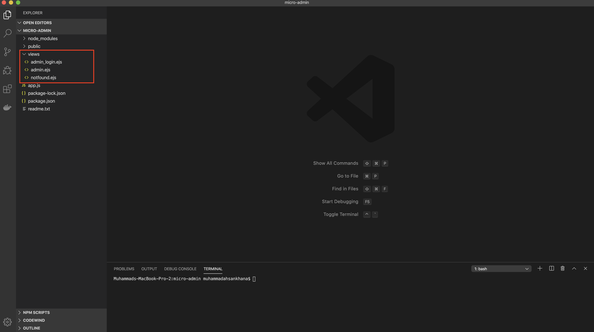

# Monolithic to Microservices Architecture using Cloud Pak for Applications

In this tutorial , we will learn how to use Cloud Pak for Applications to break down our monolithic application (Core Banking) implemented in Node.js into microservices.  

## Cloud Pak for Applications:
The IBM Cloud Pak™ for Applications provides a complete and consistent experience to speed development of applications built for Kubernetes, using agile DevOps processes.

Running on Red Hat® OpenShift®, IBM Cloud Pak for Applications provides a hybrid, multicloud foundation built on open standards, enabling workloads and data to run anywhere. It integrates two main opensource platforms Kabanero(https://kabanero.io/) and Appsody(https://appsody.dev/).

## Prerequisites:

To complete the steps in this tutorial, you need to:
1. [Install Docker](https://docs.docker.com/install/) on your local machine.

2. Install [Visual Studio Code](https://code.visualstudio.com/) for local development.

3. Create Cloud Pak for Applications service from here

## Steps:
1. [Clone & understand the architecture of monolithic application](#1-clone-the-application)
2. [Let's understand how to break down our monolithic application]
3. [How to initialize , do local development and testing using Codewind in Visual Studio](#2-clone-the-application)
4. [Intialize Tekton and integrate with our Github repository]
5. [Scale the application on your needs ]
6. [Check if the microservices are up and running]

### Step 1 :Clone & understand the architecture of monolithic application
1. We'll use this repo as it contains our Banking Monolithic Application. 
2. Open your terminal and change your directory by using the cd downloads command. (Or any other directory in which you want to clone the project)
3. Run command `https://github.com/mahsankhaan/cloud-pak-for-applications.git`.   
4. Open the project in Visual Studio.

#### Lets Understand the architecture of monolithic application:
There are 5 services under "views" folder running in a single node.js project that are tightly coupled. If we get a traffic on a single service , complete project goes down that is one of the major disadvantage of monolithic architecture. 

### Step 2 :Let's understand how to break down our monolithic application
When we cloned our project we saw there are 5 services running in the project , lets break down our monolithic application by evaluating which services are tightly coupled and on the high load on that service can effect the other services and maybe complete project. So let breakdown admin and customer services.

### Step 3 :Initialize Codewind in Visual Studio for Local development , breaking into Microservices and Testing
Once we have decided which service needs to be converted into micro-services  , initialize codewind in our visual studio that will help us to do local development , testing services and containerizing it. Please follow the below steps to work with codewind:

1. Open VisualStudio.
2. On left select Extensions and search for Codewind.
3. Install and kindly wait it will take some time to initialize.

#### Breaking into Microservices
Right now we are working with two microservices.

1. Admin Microservice:
Clone the admin microservice repo form here :
We have two services(admin_logn & admin) in the project.

2. Customer Microservice :
Clone the customer microservice repo form here :
We have two services(customer_logn & customer) in the project.

