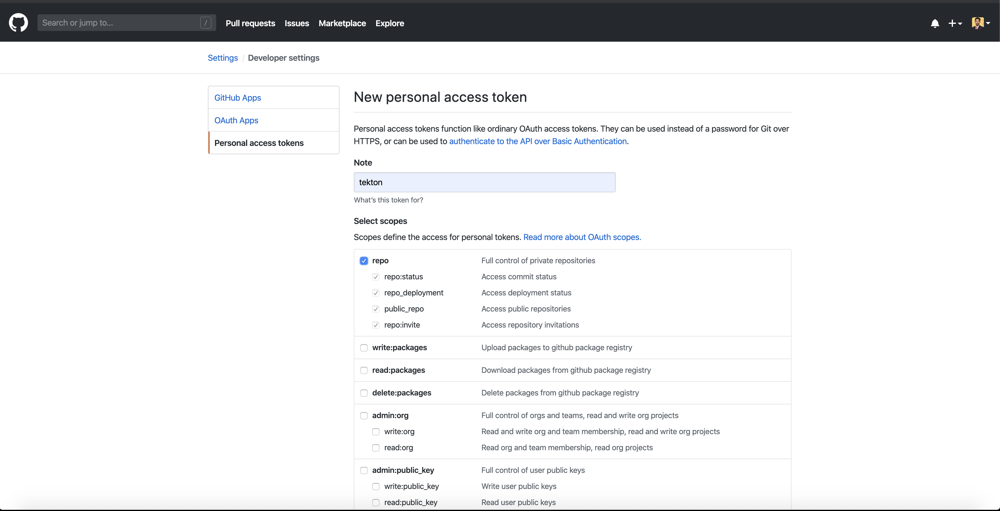

Monolithic to Microservices Architecture using IBM Cloud Pak for Applications

In this tutorial, we will learn how to use IBM Cloud Pak for Applications to break down our monolithic (Core Banking) application implemented in Node.js into microservices.  

## IBM Cloud Pak for Applications:
The IBM Cloud Pak™ for Applications provides a complete and consistent experience to speed development of applications built for Kubernetes, using agile DevOps processes.

Running on Red Hat® OpenShift®, IBM Cloud Pak for Applications provides a hybrid, multicloud foundation built on open standards, enabling workloads and data to run anywhere. It integrates two main opensource projects [Kabanero](https://kabanero.io/) and [Appsody](https://appsody.dev/).

## Prerequisites:

To complete the steps in this tutorial, you need to:

1. [Install Docker](https://docs.docker.com/install/) on your local machine.

2. Install [Visual Studio Code](https://code.visualstudio.com/) for local development.

3. Get access to a Red Hat OpenShift on IBM Cloud cluster, with IBM Cloud Pak for Applications from [here](https://cloud.ibm.com/kubernetes/catalog/openshiftcluster?cm_sp=ibmdev-_-developer-tutorials-_-cloudreg).

4. Must have Github account 

## Steps:
1. [Clone and understand the architecture of monolithic application](#1-clone-and-understand-the-architecture-of-monolithic-application)
2. [Understand how to break down our monolithic application](#2-understand-how-to-break-down-our-monolithic-application)
3. [Install Codewind in Visual Studio to create microservices test and deploy to GitHub](#3-install-codewind-in-visual-studio-to-create-microservices-test-and-deploy-to-GitHub)
4. [Intialize Tekton and integrate with github repository](#4-intialize-tekton-and-integrate-with-github-repository)
5. [Verify if the microservices are up and running](#5-verify-if-the-microservices-are-up-and-running)
6. [Conclusion](#conclusion)

### 1. Clone and understand the architecture of monolithic application

1. We'll use this repo as it contains our Banking Monolithic Application. 
2. Open your terminal and change your directory by using the cd downloads command. (Or any other directory in which you want to clone the project)
3. Run command `git clone https://github.com/mahsankhaan/cloud-pak-for-applications.git`.   
4. Open the project in Visual Studio.

#### Architecture of the monolithic application

There are 5 services under the "views" folder running in a single project that are tightly coupled.If we get workload or user's traffic on one service, suppose "user dashboard service " then all the other services that are interconnected with it can be affected or even complete project can go down which is one of the major disadvantages of monolithic architecture

### 2. Install Codewind in Visual Studio to create microservices test and deploy to GitHub 
 
Here are 5 tightly coupled services:
 
1. Admin login
2. Admin Dashboard
3. User Login 
4. User Dashboard
5. Not found 

After looking at the above services we can identify that we can breakdown Admin(login, dashboard) and User (login, dashboard) services into Microservices so they can run independently because both the services have different functionalities so we can scale it depending on the workload.

Breakdown will be into two microservices:

1. [Admin Microservice](https://github.com/mahsankhaan/micro-admin)
2. [User Microservice](https://github.com/mahsankhaan/micro-user)

#### How will we do that?
We will put Admin services in one project and User into another and deploy it on the central repo (Github) both will have their dependencies and run independently. Below architecture diagram explain everything pretty clearly, don't worry if it doesn't make sense to you right now after the next few steps you will learn and understand how to do that.

### 3. Install Codewind in Visual Studio to create microservices test and deploy to GitHub 
Once we have decided which service needs to be converted into micro-services, initialize Codewind in our visual studio that will help us to do local development, testing services and containerizing it. Please follow the below steps to work with Codewind:

1. Open VisualStudio.
2. On left select Extensions and search for Codewind.
3. Select Install and kindly wait it will take some time to initialize.
4. Once successfully installed you'll be able to see **Codewind** section on left
5. Select **Codewind** and start local Codewind.
6. Right-click on local and select **Create New Project** 
7. Select template **Kabanero Node.js Express simple template**
8. Name it as **micro-admin**.
9. Now your structure will be something like:

10. Go to **Codewind** in VS you must see your project there running as "micro-admin" right-click it and select **Open Application** this will popup the page and from there **enable project** (if it is disabled) and then select **build**. Check **Application Endpoint** it shows where your application running.

11. Test your application by right-clicking micro-admin -> **Application Monitor** and hit the application 2 or 3 times to see the changes.

12. Run `appsody build` in your VS terminal which will create a deployment file template for us and later on help in deploying our application on CP4A.
13. After the above command executed successfully on left there will be a new generated file as **app-deploy.yaml**.
14  We have successfully created an Admin microservice.
15. Follow step 3 again to create 2 microservice and name it **micro-user**. And you will end up with like the below structure.

16. Once two microservices are created we can upload it one by one to central repository **GitHub**.

Note: If you face any difficulty in executing step 3 please check out my repositories available created using Codewind
1. [Admin-microservice](https://github.com/mahsankhaan/micro-admin.git)
2. [User-microservice](https://github.com/mahsankhaan/micro-user.git)

To learn more about Codewind please visit [here](https://www.eclipse.org/codewind/mdt-vsc-overview.html)

### 4. Initialize Tekton and integrate with GitHub repository

Before we initialize Tekton it is really important to have GitHub Token, so let's create two tokens for admin and user.
Settings -> Developer settings -> personal access token -> generate new token 

Once both tokens are created you will able to see below image :

**IMPORTANT NOTE:** Please copy the token, as you won’t be able to see it again! 

#### What is Tekton and why are we using it?
Tekton is a powerful yet flexible Kubernetes-native open-source framework for creating continuous integration and delivery (CI/CD) systems. We are using Tekton because it is a built-in tool in IBM Cloud Pak for Applications that connect our central repository **GitHub** and **Webhook** that lift and shift our application source code form local development to the cloud.

To know about it please visit [here](https://developer.ibm.com/articles/introduction-to-tekton-architecture-and-design/)

Please follow below steps to initialize Tekton:
1. Open Openshift Web Console.
2. Once you are logged in successfully, select **Kabanero** from my project section.
3. From left menu select **Cloud Pak for Applications**
4. Now you can see the below screen.

5. Please go to Instance, in Tools section select  **Tekton** link and you will be redirected to the below image.

6. Select **Webhook** from the left menu and create two webhook for

a. micro-admin

b. micro-user 

7. Now check if Tekton and GitHub are successfully connected.  

**IMPORTANT NOTE** Don't worry if you are getting a red sign, it will turn green once the repo code is updated)

8. Open your Github do some changes in **(views -> user.js)** in user repository, an important step to trigger the Tekton pipeline. 

9. Next, open your Tekton dashboard on left from Tekton dropdown select **Pipeline Runs**. 

10. Wait for a while until you see your Status as **All tasks completed executing**. It means we have successfully integrated our central repo to our Tekton instance on IBM Cloud Pak for applications.  

**IMPORTANT NOTE**: First do the changes in **User repository** and once it is successfully built and deploy then update the **Admin repository** or vice versa.

For more details about Tekton, please check out this great tutorial [here](https://developer.ibm.com/tutorials/deploy-appsody-to-openshift-with-tekton-pipelines/)

### 5. Verify if the microservices are up and running
1. Open the Openshift dashboard.
2. Once the dashboard is open from the left menu select Application.
3. Go in routes and there will be two services up and running.
4. To run the application click links in **Hostname**

#### User :

#### Admin :

### 6. Conclusion
In this tutorial, we have learned the complete lifecycle of Architecture modernization using IBM Cloud Pak for Applications. We've seen how can we integrate Codewind in our visual studio that helps in breaking down the monolithic project into microservices and how can we test, debug and monitor each service independently. Once we are satisfied with our services in local development then we can deploy it to the central repo GitHub.From there learn how to create GitHub token and integrate Tekton instance from CP4A that helps in CI/CD process that fetches all the changes done by the local development team. Both the microservices running successfully and independently on Openshift and now we can scale them depending on the workload. In the future, we can integrate as many microservices as we want without affecting or shutting down the complete application.
